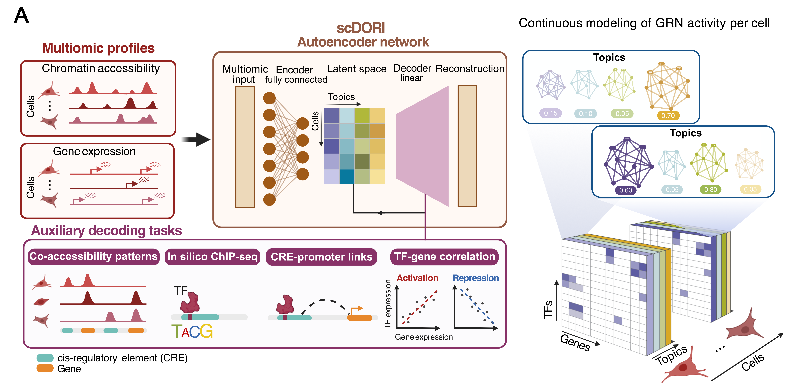

.. _index:

=========================================================
Welcome to scDoRI: Single-cell Deep Multi-Omic Inference
=========================================================

**scDoRI** jointly models single-cell RNA-seq and ATAC-seq to infer
**enhancer-mediated gene regulatory networks (eGRNs)**. It couples an
**Encoder-Decoder** neural architecture with mechanistic constraints
(enhancer-gene links, TF activators/repressors), yielding
**topics** of co-accessible peaks, co-expressed genes, TF regulators and their enhancer-mediated downstream targets.
By training in mini-batches, scDoRI handles large datasets while capturing
continuous, cell-specific changes in gene regulation.

Key Highlights
--------------

- **Unified** approach: single model for dimensionality reduction + eGRN inference
- **Biological insights**:  identifies lower dimensional topics, candidate enhancer-gene links, co-regulated gene programs, TF-gene networks per topic
- **Continuous eGRN Modelling without predefined clusters**: each cell is a mixture of regulatory topics, allowing assemement of fine-grained changes in regulatory programs
- **Scalable**: mini-batch training for large single-cell multiome datasets

Project Layout
--------------

- **preprocessing_pipeline/**  
  Scripts + a `config.py` for data filtering, highly variable peak/gene/TF selection. Also computes in-silico ChIP-seq matrix.

- **scdori/**  
  Core scDoRI model code + another `config.py` for hyperparameters 
  (number of topics, learning rate, sparsity, etc.).

- **notebooks/**  
  - `preprocessing.ipynb`: Load & filter multi-ome data, obtain in-silico ChIP-seq matrix and other preprocessing steps.
  - `training.ipynb`: Train the scDoRI autoencoder with mini-batches, produce eGRN outputs.

- **environment.yml**  
  Conda environment specifying dependencies (scanpy, pytorch, etc.).

- **cisbp_motif_file**  
  Example motif DB for mouse/human. If you use a custom motif file, 
  set the path in the config.

Installation and Usage
----------------------

1. **Clone** this repo + create the environment:

   .. code-block:: bash

      git clone https://github.com/YourUser/scDoRI.git
      cd scDoRI
      conda env create -f environment.yml
      conda activate scdori-env

2. **Edit** config files:
   - `preprocessing_pipeline/config.py` to specify location of RNA and ATAC anndata .h5ad files, motif file, and set number of peaks/genes/TFs to train on.
   - `scdori/config.py` for scDoRI hyperparameters (number of topics, learning rate, epochs etc.)

3. **Run** notebooks in order:
   - `notebooks/preprocessing.ipynb`
   - `notebooks/training.ipynb`

.. caution::
   If using a mouse dataset, set ``species = "mouse"`` in config. 
   For human, change accordingly and update your motif file path (cisbp or custom).
   Ensure consistent schema in motif meme file compared to the example cisbp file provided.

Tutorial Notebooks
------------------

.. grid:: 2
   :gutter: 2

   .. card:: Preprocessing (Notebook 1)
      :link: notebooks/preprocessing
      :link-type: doc

      - **Filter** to highly variable genes/peaks/TFs
      - **Compute** in-silico ChIP-seq from your motif DB, peak-gene distances
      - **Output** processed data, insilico-chipseq matrix, peak-gene distances

   .. card:: Training (Notebook 2)
      :link: notebooks/training
      :link-type: doc
    
      - **Train** model with mini-batches
      - **Infer** topics and TF–gene networks
      - **Downstream analysis** using inferred eGRNs and topic activities

API Reference
-------------

See the :doc:`api_reference` page for documentation on:

- **preprocessing_pipeline** scripts
- **scdori** model scripts

These detail function usage, parameters, and advanced features.

License & Citation
------------------

This project is under MIT License. If scDoRI aids your research, please cite our 
upcoming publication. For questions, open a GitHub Issue or email the maintainers.

.. toctree::
   :maxdepth: 2
   :hidden:

   api_reference
